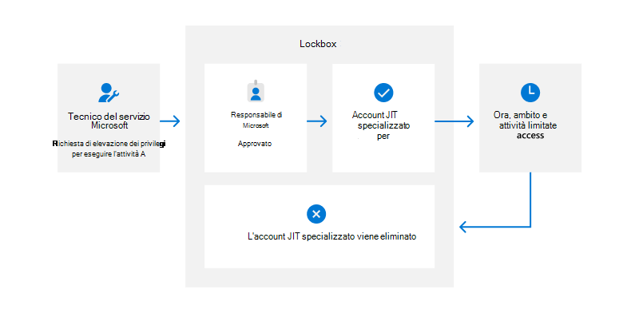

# Microsoft 365 controllo degli accessi dei service engineer

Zero Standing Access (ZSA) significa che il personale del team del servizio Microsoft non dispone di alcun accesso privilegiato permanente all'ambiente di Microsoft 365 di produzione o ai dati dei clienti. Quando un membro del team del servizio Microsoft desidera aggiornare il servizio o accedere ai dati dei clienti per qualsiasi motivo, deve inviare una richiesta giustificando l'esigenza e ricevendo l'approvazione da un manager autorizzato. Su larga scala, non è possibile fornire e rimuovere manualmente l'accesso come necessario per mantenere i servizi Microsoft 365, quindi Microsoft ha sviluppato una soluzione automatizzata per gestire l'accesso con privilegi in base alle esigenze.

## Lockbox

Tutti gli accessi ai sistemi Microsoft 365 e ai dati dei clienti vengono intermediati da Lockbox, un sistema di controllo di accesso che utilizza un modello JIT (Just-In-Time) e Just-Enough-Access (JEA) per fornire ai tecnici del servizio l'accesso con privilegi temporanei a dati e servizi Microsoft 365 specificati. Inoltre, tutte le richieste e le azioni vengono registrate a scopo di controllo e sono accessibili tramite [l'API](/office/office-365-management-api/get-started-with-office-365-management-apis) di Office 365 Management Activity e il Centro sicurezza [e conformità.](https://protection.office.com/)

Prima che un tecnico del servizio Microsoft possa connettersi a qualsiasi sistema Microsoft 365 o accedere ai dati dei clienti, deve inviare una richiesta di accesso tramite Lockbox. Questa richiesta può essere approvata solo se vengono soddisfatti determinati criteri:

- Il tecnico del servizio soddisfa [i requisiti di idoneità per un account del team di servizio,](assurance-microsoft-365-account-management.md)
- Appartengono al ruolo Lockbox associato al lavoro nella richiesta,
- Il tempo di accesso richiesto non supera il tempo massimo consentito,
- Hanno una giustificazione aziendale legittima,
- La risorsa richiesta a cui desidera accedere rientra nell'ambito di lavoro e
- Ricevono l'approvazione del manager

Dopo che tutti i criteri sono stati soddisfatti e verificati da Lockbox, viene concesso l'accesso temporaneo per eseguire l'azione specifica richiesta. Una volta trascorso il tempo per la richiesta, l'accesso viene revocato.

Inoltre, se un cliente licenze e abilita la funzionalità [Customer Lockbox,](/microsoft-365/compliance/customer-lockbox-requests) qualsiasi tentativo di un tecnico del servizio Microsoft di accedere ai dati del cliente deve essere approvato da un amministratore nel tenant del cliente. La necessità di accedere ai dati dei clienti può derivare sia dal cliente che da Microsoft. Ad esempio, un evento imprevisto generato da un cliente potrebbe richiedere l'accesso ai propri dati per risolvere il problema o quando Microsoft necessita dell'accesso ai dati per applicare un aggiornamento specifico.

I clienti non hanno strumenti per avviare una richiesta Customer Lockbox; devono inviare a Microsoft un ticket che richiede la richiesta di Customer Lockbox. Una richiesta Customer Lockbox generata da un tecnico del servizio Microsoft deve essere approvata da un responsabile Microsoft e da un amministratore autorizzato nel tenant del cliente.

### Ruoli di Lockbox

Per applicare la separazione dei compiti e il principio dei privilegi minimi, i tecnici del servizio devono appartenere a un ruolo Lockbox corrispondente al loro ruolo nel team. I ruoli di Lockbox vengono gestiti all'interno dello strumento di gestione delle identità e definiscono i privilegi e le azioni per cui un membro del team di servizio può essere approvato tramite il processo di richiesta Lockbox. Il personale del team di servizio deve richiedere di essere membro di un ruolo Lockbox e ricevere l'approvazione di gestione. Se approvato, l'account del team di servizio del dipendente viene inserito in un gruppo di sicurezza applicato da Active Directory (AD) e Azure Active Directory (AAD).

## Interfacce di gestione vincolata

I tecnici del servizio utilizzano due interfacce di gestione per eseguire attività amministrative: Desktop remoto da una workstation di accesso sicuro (SAW, Secure Access Workstation) attraverso un gateway del servizio terminal (TSG) protetto e PowerShell remoto. All'interno di queste interfacce di gestione, i controlli di accesso basati sulla richiesta Lockbox approvata e sui criteri software determinano restrizioni significative sulle applicazioni eseguite e sui comandi e sui cmdlet disponibili.

## Desktop remoto

I membri del team di servizio che si administrato il servizio tramite Desktop remoto devono connettersi da un computer portatile SAW, appositamente progettato e prodotto gestito da Microsoft in modo specifico per questo caso d'uso. Microsoft collabora con i fornitori per creare saW, creando una catena di approvvigionamento breve e sicura. I saW utilizzano sistemi operativi con protezione avanzata configurati per limitare tutte le funzionalità tranne quelle necessarie per le attività di gestione definite. Queste limitazioni includono la disabilitazione di tutte le porte USB, gli elenchi di accesso alle applicazioni rigorosi, la rimozione dell'accesso alla posta elettronica, la limitazione dell'esplorazione internet e l'applicazione dei blocchi degli screensaver inattivi. I sistemi di controllo di accesso Microsoft esaminano periodicamente i computer SAW per assicurarsi che siano conformi ai controlli di sicurezza più recenti e disabilitano automaticamente i computer se sono determinati a non essere conformi.

Ai tecnici del servizio è consentito connettersi a un solo gruppo di sicurezza per volta e non sono consentite più sessioni. I gruppi di sicurezza dei servizi di Microsoft 365 tuttavia consentono agli amministratori del team del servizio di connettersi a più server, ognuno con una sola sessione simultanea, in modo che gli amministratori possano svolgere efficacemente le proprie mansioni. Gli amministratori del team del servizio non dispongono di autorizzazioni per i gruppi di sicurezza dei servizi di dominio. Il gruppo TSG viene utilizzato solo per applicare l'autenticazione a più fattori (MFA) e i requisiti di crittografia. Una volta che l'amministratore del team del servizio si connette a un server specifico tramite un gruppo di protezione dei servizi, il server specifico applica un limite di sessione di uno per ogni amministratore.

Le restrizioni di utilizzo, la connessione e i requisiti di configurazione per Microsoft 365 personale sono stabiliti dai criteri di gruppo di Active Directory. Questi criteri includono le caratteristiche TSG seguenti:

- Utilizzare solo [la crittografia convalidata FIPS 140-2](/compliance/regulatory/offering-FIPS-140-2)
- Sessioni disconnesse dopo 15 minuti di inattività
- Sessioni disconnesse automaticamente dopo 24 ore

Le connessioni ai TSG richiedono anche LFA tramite una smart card fisica separata. I tecnici del servizio vengono emessi smart card diverse per diverse piattaforme e piattaforme di gestione dei segreti assicurano l'archiviazione sicura delle credenziali. I gruppi di servizi terminal utilizzano i criteri di gruppo di Active Directory per controllare chi può accedere ai server remoti, il numero di sessioni consentite e le impostazioni di timeout di inattività.

## Remote PowerShell

Oltre all'accesso remoto tramite TSG configurati appositamente, il personale del team di servizio con il ruolo Service Engineer Operations Lockbox può accedere a determinate funzionalità amministrative nei server di produzione tramite Remote PowerShell. Per utilizzare questo accesso, l'utente deve essere autorizzato per l'accesso di sola lettura (debug) all'Microsoft 365 di produzione. L'escalation dei privilegi è abilitata nello stesso modo in cui viene abilitata per i TSG tramite il processo Lockbox.

Per l'accesso remoto, ogni datacenter dispone di un IP virtuale con bilanciamento del carico che funge da singolo punto di accesso. I cmdlet di Remote PowerShell disponibili si basano sul livello di privilegio identificato nell'attestazione di accesso ottenuta durante l'autenticazione. Questi cmdlet forniscono l'unica funzionalità amministrativa accessibile dagli utenti che si connettono utilizzando questo metodo. Remote PowerShell limita l'ambito dei comandi disponibili per il tecnico e si basa sul livello di accesso concesso tramite il processo Lockbox. Ad esempio, in Exchange Online, il cmdlet Get-Mailbox potrebbe essere disponibile, ma il cmdlet Set-Mailbox non lo sarebbe.

## Risorse

- [Isolamento in Microsoft 365](assurance-isolation-in-microsoft-365.md)
- [Screening pre-employment](assurance-pre-employment-screening.md)[Microsoft cloud background check](assurance-cloud-background-check.md)
