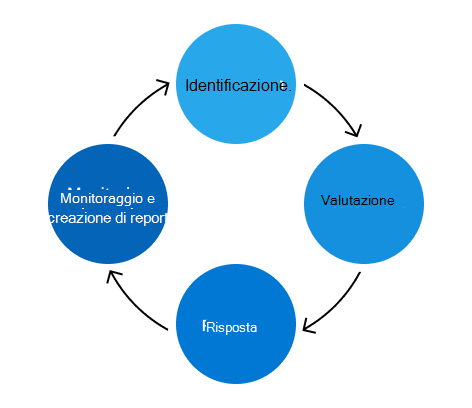

# Programma di gestione dei rischi Microsoft 365

Lo scopo del programma Microsoft 365 gestione dei rischi è identificare, valutare e gestire i rischi da Microsoft 365. Microsoft 365 priorità è soddisfare gli obblighi contrattuali e gli accreditamenti, aumentare la fiducia dei clienti e mantenere il vantaggio competitivo. Sebbene il programma Microsoft 365 Risk Management funzioni in modo indipendente, si allinea ai criteri, alle priorità e alle metodologie del programma ERM (Enterprise Risk Management). L'utilizzo del programma ERM consente un confronto coerente tra le unità aziendali e i gruppi di progettazione, contribuendo a un approccio più coesivo alla gestione dei rischi in tutta l'azienda.

Il team Microsoft 365 Trust è responsabile della gestione del programma di gestione dei rischi di Microsoft 365 e dell'esecuzione delle attività previste dal programma ERM. Il team trust si concentra sull'integrazione del framework di gestione dei rischi con i processi di Microsoft 365 progettazione, gestione dei servizi e conformità esistenti per rendere il programma di gestione dei rischi più efficace ed efficiente.

Il team trust gestisce anche Microsoft 365 Controls Framework, un set di controlli razionalizzati che, se implementati correttamente con attività di conformità di supporto, consentono ai team di progettazione di conformarsi a normative e certificazioni chiave. Questo framework viene costantemente aggiornato in base al feedback e ai risultati nell'ambito del processo di gestione dei rischi.

Le attività di gestione dei rischi sono suddivise in quattro fasi: identificazione, valutazione, risposta e monitoraggio e creazione di report.

## Identificazione

Il processo di gestione dei rischi inizia con l'identificazione di tutti i possibili rischi per tutte le aree di controllo chiave, le minacce interne ed esterne e le vulnerabilità nell'Microsoft 365 locale. Le informazioni che guidano questo processo provengono da più fonti, tra cui interviste, analisi delle vulnerabilità, esercitazioni di simulazione degli attacchi, risultati di controllo e attività di gestione degli incidenti.

Il team trust intervista esperti in materia (PMI) di più team di servizi sui rischi identificati in precedenza e sui potenziali rischi futuri che possono essere introdotti con l'aumentare dei servizi. Inoltre, le PMI aiutano a convalidare l'accuratezza e la completezza dei rischi identificati dalle altre fonti di monitoraggio continuo.

La fase di identificazione si verifica anche quando vengono esaminati i registri delle decisioni, le eccezioni di sicurezza e conformità attive e il lavoro di mitigazione delle valutazioni dei rischi precedenti.

## Valutazione

Ogni rischio identificato viene valutato utilizzando tre metriche: impatto, probabilità e deficit di controllo.

- L'impatto si riferisce al danno che si verificherebbe al servizio, all'azienda o a Microsoft se tale rischio fosse realizzato. L'impatto per Microsoft può includere danni alla reputazione, perdita di clienti o implicazioni legali/di conformità.
- Probabilità definisce la probabilità del rischio potenziale realizzato e viene calcolata analizzando la probabilità e la frequenza con cui si verificherà.
- La mancanza di controllo misura l'efficacia dei controlli di mitigazione implementati.

Queste metriche vengono utilizzate per calcolare un punteggio di rischio che rappresenta la gravità di ogni rischio, in base alle strategie di mitigazione esistenti. I rischi vengono aggregati e presentati ai principali stakeholder di ogni servizio per verificare l'accuratezza e la completezza Microsoft 365 postura dei rischi.

## Risposta

Utilizzando l'elenco verificato dei rischi da Microsoft 365, il team trust assegna i rischi al servizio interessato per la risposta ai rischi. Linee guida definite consentono di determinare la strategia di risposta ai rischi appropriata in base al punteggio di rischio e all'efficacia del controllo. Le strategie di risposta ai rischi si suddividono in quattro categorie:

- Tolleranza: aree di esposizione a basso rischio con un basso livello di controllo.
- Intervento: aree di esposizione a basso rischio in cui i controlli sono ritenuti adeguati.
- Monitoraggio: aree di esposizione ad alto rischio in cui i controlli sono ritenuti adeguati e devono essere monitorati per verificarne l'efficacia.
- Migliorare: aree di esposizione ad alto rischio con un basso livello di controllo che sono le principali priorità nell'indirizzamento.

Il team trust si coordina con i team di servizio per sviluppare piani per affrontare ogni rischio. Il livello di gravità determina il livello appropriato di revisione e approvazione per ogni piano. Per i rischi che richiedono un'azione, i processi di bug di progettazione esistenti vengono utilizzati per tenere traccia, gestire e prendere decisioni relative alle eccezioni. L'utilizzo di un processo familiare ai team di progettazione e funzionamento rende più efficiente ed efficace la risposta ai rischi.

## Monitoraggio e creazione di report

I rischi identificati come parte della valutazione dei rischi vengono monitorati e segnalati alle parti interessate pertinenti. Le strategie di monitoraggio includono il monitoraggio della sicurezza, le revisioni periodiche dei rischi, i test di penetrazione e l'analisi delle vulnerabilità. Queste attività di monitoraggio fungono da origini dati per la creazione di report sugli indicatori di prestazioni chiave, la creazione di dashboard e lo sviluppo di report formali, che informano le decisioni future sui rischi.

Più volte all'anno, il team trust si incontra con i proprietari dei rischi di ogni servizio per esaminare i punteggi dei rischi, valutare l'efficacia dei propri piani d'azione e apportare aggiornamenti dove necessario. Inoltre, le attività di valutazione dei rischi di Microsoft 365 contribuiscono alle valutazioni dei rischi di Enterprise del programma ERM, che forniscono una panoramica generale della posizione di Microsoft sui rischi per i dirigenti Microsoft e il programma ERM.
