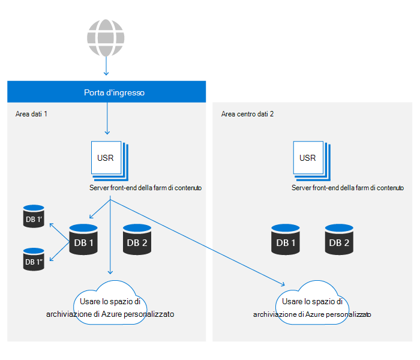
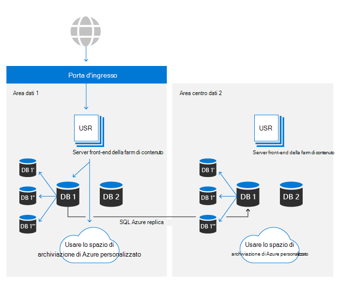

# Resilienza dei dati di SharePoint e OneDrive in Microsoft 365

All'interno di Microsoft 365, OneDrive è basato sulla piattaforma file di SharePoint. In questo articolo verrà utilizzato solo SharePoint per fare riferimento a entrambi i prodotti. Il contenuto di questo articolo è rilevante per Microsoft 365 e non si applica ai servizi per gli utenti.

Esistono due asset principali che costituiscono l'archiviazione del contenuto di base di SharePoint:

- **Metadati**: i metadati relativi a ogni file vengono archiviati in Azure SQL Database. Azure SQL offre una storia completa di continuità aziendale utilizzata da SharePoint e i dettagli sono trattati più avanti in questo articolo.
- **Archiviazione BLOB:** il contenuto utente caricato in SharePoint viene archiviato in Archiviazione di Azure. SharePoint ha creato un piano di resilienza personalizzato su Archiviazione di Azure per garantire la duplicazione quasi in tempo reale del contenuto degli utenti e un sistema realmente attivo/attivo.

L'insieme completo di controlli per garantire la resilienza dei dati è illustrato nelle sezioni successive.

## Resilienza dell'archiviazione BLOB

SharePoint dispone di una soluzione personalizzata per l'archiviazione dei dati dei clienti in Archiviazione di Azure. Ogni file viene scritto contemporaneamente in un'area datacenter principale e secondaria. Se le scritture in una delle due aree di Azure hanno esito negativo, il salvataggio del file avrà esito negativo. Dopo aver scritto il contenuto in Archiviazione di Azure, i checksum vengono archiviati separatamente con i metadati e vengono usati per garantire che la scrittura di cui è stato eseguito il commit sia identica al file originale inviato a SharePoint durante tutte le operazioni di lettura future. Questa stessa tecnica viene utilizzata in tutti i flussi di lavoro per impedire la propagazione di eventuali danneggiamenti che dovrebbero verificarsi. All'interno di ogni area geografica, Azure Locally Redundant Storage (LRS) offre un livello elevato di affidabilità. Per informazioni [dettagliate, vedere](/azure/storage/common/storage-redundancy-lrs) l'articolo Sulla ridondanza di Archiviazione di Azure.

SharePoint utilizza Append-Only archiviazione. Questo processo garantisce che i file non possano essere modificati o danneggiati dopo un salvataggio iniziale, ma anche utilizzando il controllo delle versioni nel prodotto, è possibile recuperare qualsiasi versione precedente del contenuto del file.

Gli ambienti SharePoint in entrambi i datacenter possono accedere ai contenitori di archiviazione in entrambe le aree di Azure. Per motivi di prestazioni, il contenitore di archiviazione nello stesso datacenter locale è sempre preferibile, tuttavia, le richieste di lettura che non visualizzano risultati entro una soglia desiderata avranno lo stesso contenuto richiesto dal datacenter remoto per garantire che i dati siano sempre disponibili.

## Resilienza dei metadati

I metadati di SharePoint sono fondamentali anche per accedere al contenuto degli utenti in quanto archivia la posizione e le chiavi di accesso al contenuto archiviato in Archiviazione di Azure. Questi database sono archiviati in Azure SQL, che dispone di un ampio [piano di continuità aziendale.](/azure/sql-database/sql-database-business-continuity)

SharePoint usa il modello di replica fornito da Azure SQL e ha creato una tecnologia di automazione proprietaria per determinare se è necessario un failover e avviare l'operazione, se necessario. Di conseguenza, rientra nella categoria "Failover manuale del database" da una prospettiva SQL Azure. Le metriche più recenti per la recuperabilità SQL database di Azure sono [disponibili qui.](/azure/azure-sql/database/business-continuity-high-availability-disaster-recover-hadr-overview#recover-a-database-to-the-existing-server)

SharePoint usa il SQL di backup di Azure per abilitare i ripristini temporici (PITR) per un massimo di 14 giorni. PITR è più trattato in una [sezione successiva.](#deletion-backup-and-point-in-time-restore)

## Failover automatico

SharePoint usa un failover automatico personalizzato per ridurre al minimo l'impatto sull'esperienza del cliente quando si verifica un evento specifico della posizione. L'automazione basata sul monitoraggio rileva un errore singolo o multi-componente oltre determinate soglie comporterà il reindirizzamento automatico dell'attività di tutti gli utenti dall'ambiente problematico e da un secondario caldo. Un failover determina che i metadati e l'archiviazione di calcolo vengano serviti interamente dal nuovo datacenter. Poiché l'archiviazione BLOB viene sempre eseguita interamente attiva/attiva, non è necessaria alcuna modifica per un failover. Il livello di calcolo preferirà il contenitore BLOB più vicino, ma utilizzerà posizioni di archiviazione BLOB sia locali che remote in qualsiasi momento per garantire la disponibilità.

SharePoint usa il servizio Azure Front Door per fornire il routing interno alla rete Microsoft. Questa configurazione consente il reindirizzamento del failover indipendentemente dal DNS e riduce l'effetto della memorizzazione nella cache del computer locale. La maggior parte delle operazioni di failover è trasparente per gli utenti finali. In caso di failover, i clienti non dovranno apportare modifiche per mantenere l'accesso al servizio.

## Controllo delle versioni e ripristino dei file

Per le raccolte documenti appena create, SharePoint ha per impostazione predefinita 500 versioni in ogni file e può essere configurato per conservare altre versioni, se lo si desidera. L'interfaccia utente non consente l'impostazione di un valore inferiore a 100 versioni, ma è possibile impostare il sistema in modo che archivi un numero inferiore di versioni usando le API pubbliche. Per l'affidabilità, qualsiasi valore inferiore a 100 non è consigliato e può causare una perdita accidentale di dati da parte dell'utente.

Per ulteriori informazioni sul controllo delle versioni, vedere [Versioning in SharePoint](/microsoft-365/community/versioning-basics-best-practices).

Ripristino file è la possibilità di tornare indietro nel tempo in qualsiasi raccolta documenti in SharePoint a un secondo di tempo negli ultimi 30 giorni. Questo processo può essere utilizzato per il ripristino da ransomware, eliminazioni di massa, danneggiamenti o qualsiasi altro evento. Questa funzionalità utilizza le versioni dei file in modo che la riduzione delle versioni predefinite possa ridurre l'efficacia di questo ripristino.

La funzionalità Ripristino file è documentata sia per [OneDrive](https://support.office.com/article/restore-your-onedrive-fa231298-759d-41cf-bcd0-25ac53eb8a15) che per [SharePoint.](https://support.office.com/article/Restore-a-document-library-317791c3-8bd0-4dfd-8254-3ca90883d39a)

## Eliminazione, backup e ripristino point-in-time

Il contenuto utente eliminato da SharePoint passa attraverso il flusso di eliminazione seguente.

Gli elementi eliminati vengono conservati nei Cestini per un determinato periodo di tempo. Per SharePoint, il tempo di conservazione è di 93 giorni. Inizia quando si elimina l'elemento dalla posizione originale. Quando si elimina l'elemento dal Cestino del sito, questo viene inserito nel [Cestino della raccolta siti.](https://support.office.com/article/restore-deleted-items-from-the-site-collection-recycle-bin-5fa924ee-16d7-487b-9a0a-021b9062d14b) Rimane lì per il resto dei 93 giorni e quindi viene eliminato definitivamente. Per ulteriori informazioni su come utilizzare il Cestino, vedere i collegamenti seguenti:

- [Ripristinare gli elementi nel Cestino](https://support.office.com/article/Restore-items-in-the-Recycle-Bin-of-a-SharePoint-site-6df466b6-55f2-4898-8d6e-c0dff851a0be)
- [Ripristinare gli elementi eliminati dal Cestino della raccolta siti.](https://support.office.com/article/Restore-deleted-items-from-the-site-collection-recycle-bin-5fa924ee-16d7-487b-9a0a-021b9062d14b)

Questo processo è il flusso di eliminazione predefinito e non prende in considerazione i criteri o le etichette di conservazione. Per ulteriori informazioni, vedere [Informazioni sulla conservazione per SharePoint e OneDrive.](/microsoft-365/compliance/retention-policies-sharepoint)

Al termine della pipeline di riciclo di 93 giorni, l'eliminazione avviene in modo indipendente per i metadati e per l'archiviazione BLOB. I metadati verranno rimossi immediatamente dal database, il che rende il contenuto illeggibile a meno che i metadati non vengano ripristinati dal backup. SharePoint gestisce backup di metadati per 14 giorni. Questi backup vengono evasi localmente in tempo quasi reale e quindi inviati all'archiviazione in contenitori ridondanti di Archiviazione di Azure [su,](/azure/sql-database/sql-database-automated-backups) in base alla documentazione al momento della pubblicazione, una pianificazione di 5-10 minuti.

Quando si elimina il contenuto dell'archiviazione BLOB, SharePoint utilizza la funzionalità di eliminazione soft per Archiviazione BLOB di Azure per la protezione da eliminazioni accidentali o dannose. Usando questa funzionalità, abbiamo un totale di 14 giorni in cui ripristinare il contenuto prima che venga eliminato definitivamente.

>[!Note]
>Mentre le applicazioni Microsoft invieranno contenuto al Cestino per il processo standard, SharePoint fornisce API che consentono di ignorare il Cestino e forzare un'eliminazione immediata. Esaminare le applicazioni per assicurarsi che questa operazione sia eseguita solo quando necessario per motivi di conformità.

## Controlli di integrità

SharePoint usa diversi metodi per garantire l'integrità di BLOB e metadati in tutte le fasi del ciclo di vita dei dati:

- **Hash del file archiviato nei metadati:** l'hash dell'intero file viene archiviato con i metadati del file per garantire che l'integrità dei dati a livello di documento sia mantenuta durante tutte le operazioni
- **Hash BLOB archiviato nei metadati**: ogni elemento BLOB archivia un hash del contenuto crittografato per la protezione da danneggiamenti nell'archiviazione di Azure sottostante.
- **Processo di integrità dei** dati : ogni 14 giorni, ogni sito viene analizzato per verificare l'integrità elencando gli elementi nel database e abbinando quelli con i BLOB elencati nell'archiviazione di Azure. Il processo segnala eventuali riferimenti BLOB mancanti ai BLOB di archiviazione e può recuperare tali BLOB tramite la funzionalità di eliminazione recidiva dell'archiviazione di [Azure,](/azure/storage/blobs/soft-delete-blob-overview) se necessario.
