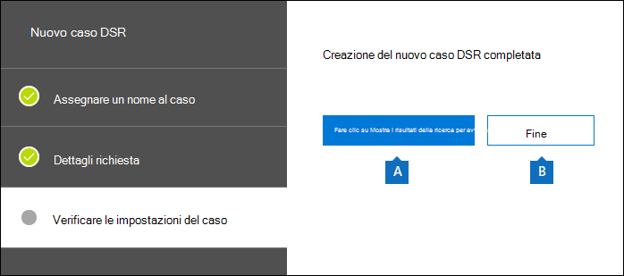
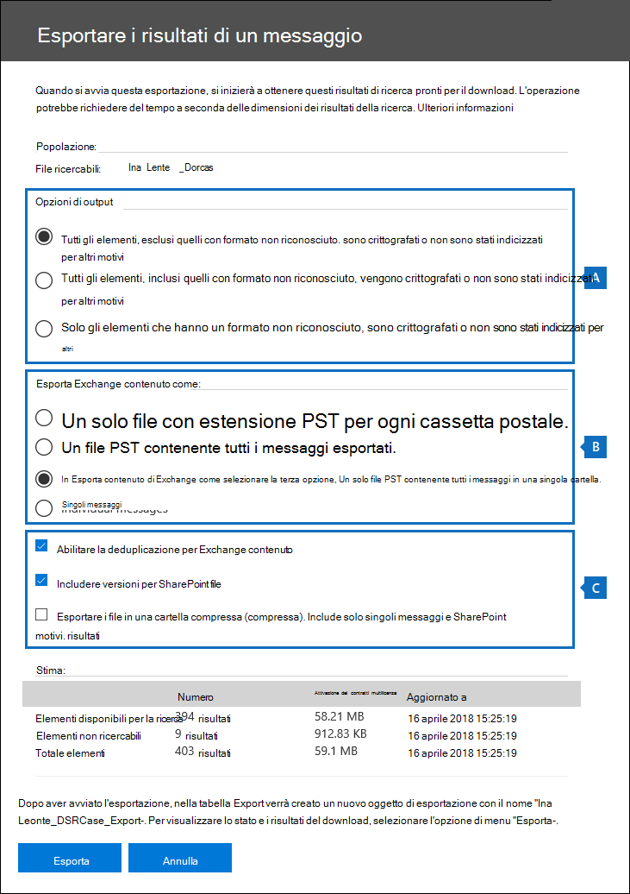
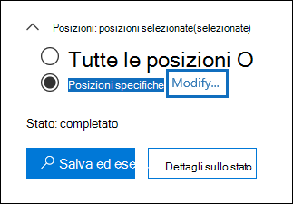
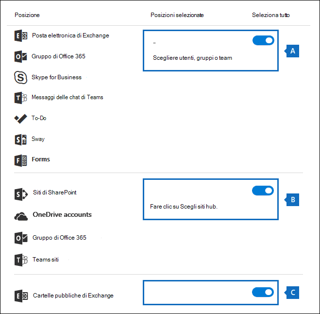
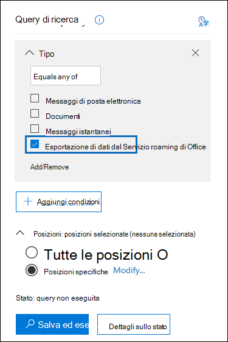
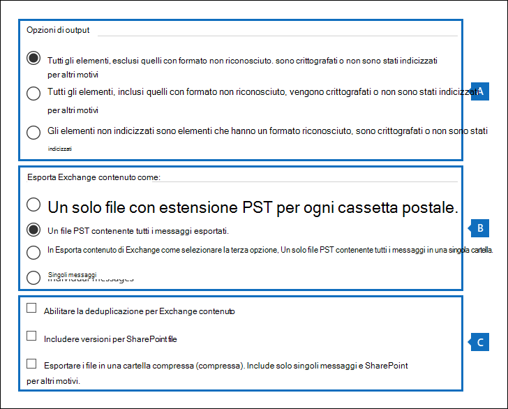

# <a name="manage-gdpr-data-subject-requests-with-the-dsr-case-tool-in-the-security--compliance-center"></a>Gestire richieste degli interessati per il GDPR con lo strumento per i casi DSR nel Centro sicurezza e conformità

Il Regolamento generale sulla protezione dei dati (GDPR) dell'Unione Europea si propone di tutelare e supportare i diritti alla privacy dei cittadini dell'UE. Il GDPR concede ai cittadini dell'UE (detti "interessati") il diritto di accedere, recuperare, correggere, cancellare e limitare l'elaborazione dei loro dati personali. In base alla definizione del GDPR, per dati personali si intende qualsiasi informazione relativa a una persona fisica identificata o identificabile. Una richiesta formale rivolta da una persona alla sua organizzazione in merito a un'operazione da effettuare sui propri dati personali è denominata Richiesta dell'interessato o DSR. Per informazioni dettagliate su come rispondere alle richieste degli interessati per i dati in Office 365, vedere la [guida alle richieste degli interessati per Office 365](https://go.microsoft.com/fwlink/?linkid=871169 ).
  
Per gestire le indagini in risposta a una richiesta dell'interessato inviata da una persona dell'organizzazione, è possibile usare lo strumento di gestione dei casi DSR nel Centro sicurezza e conformità per trovare contenuti archiviati in:
  
- Qualsiasi cassetta postale utente nell'organizzazione. Sono incluse le conversazioni di Skype for Business e le chat tra due persone in Microsoft Teams
    
- Tutte le cassette postali associate a un gruppo di Microsoft 365 e tutte le cassette postali dei team in Microsoft Teams
    
- Tutti i siti di SharePoint Online e gli account di OneDrive for Business nell'organizzazione
    
- Tutti i siti di Teams e i siti dei gruppi di Microsoft 365 nell'organizzazione
    
- Tutte le cartelle pubbliche in Exchange Online
    
Con lo strumento per i casi DSR è possibile:
  
- Creare un caso distinto per ogni indagine DSR.
    
- Controllare chi può accedere al caso DSR aggiungendo utenti come membri dello stesso. Solo i membri possono accedere al caso e possono vedere solo i propri nell'elenco presente nella pagina dei **casi di richiesta dell'interessato** del Centro sicurezza e conformità. È possibile anche assegnare autorizzazioni differenti a membri diversi dello stesso caso. Ad esempio, è possibile consentire ad alcuni membri solo di visualizzare il caso e i risultati della ricerca e consentire ad altri membri di creare ricerche ed esportarne i risultati. 
    
- Usare la ricerca predefinita per cercare tutto il contenuto creato o caricato da uno specifico interessato.
    
- Facoltativamente, modificare la query di ricerca predefinita e ripetere la ricerca per restringere i risultati della ricerca.
    
- Aggiungere altre ricerche di contenuto associate al caso di richiesta dell'interessato. Questo include le ricerche che restituiscono elementi parzialmente indicizzati e log generati dal sistema provenienti dal Servizio roaming di Office.
    
- Esportare dati in risposta a una richiesta dell'interessato di accesso ai dati o esportazione.
    
- Eliminare casi quando il processo di indagine DSR è terminato. In questo modo vengono rimosse tutte le ricerche di contenuto e i processi di esportazione associati al caso.
    
Ecco il processo di alto livello per usare lo strumento per i casi DSR per gestire le indagini DSR:
  
[Passaggio 1: Assegnare le autorizzazioni di eDiscovery a potenziali membri del caso](#step-1-assign-ediscovery-permissions-to-potential-case-members)

[Passaggio 2: Creare un nuovo caso e aggiungere membri](#step-2-create-a-dsr-case-and-add-members)

[Passaggio 3: Eseguire la query di ricerca](#step-3-run-the-search-query)

[Passaggio 4: Esportare i dati](#step-4-export-the-data)

[(Facoltativo) Passaggio 5: Modificare la query di ricerca predefinita](#optional-step-5-revise-the-built-in-search-query)

[Altre informazioni sull'uso dello strumento per i casi DSR](#more-information-about-using-the-dsr-case-tool)
  
> [!IMPORTANT]
> I nostri strumenti possono aiutare gli amministratori a eseguire richieste di accesso o esportazione DSR, servendosi della funzionalità di ricerca ed esportazione incorporata nello strumento per i casi DSR. Questo strumento offre un metodo basato sul massimo sforzo per esportare i dati pertinenti in seguito a eventuali richieste degli interessati. Tuttavia, è importante tenere presente che i risultati della ricerca possono variare in base all'interessato o alle azioni eseguite dall'amministratore, che possono influire sul fatto che un elemento venga o meno considerato come "dati personali" ai fini dell'esportazione. Ad esempio, se l'interessato è l'ultima persona che ha modificato un file che non ha creato personalmente, il file potrebbe non essere restituito nei risultati della ricerca. Analogamente, un amministratore potrebbe esportare i dati senza includere elementi parzialmente indicizzati o tutte le versioni dei documenti di SharePoint. Di conseguenza, gli strumenti forniti facilitano l'accesso e l'esportazione nell'ambito delle richieste di dati, ma i risultati sono condizionati dagli specifici scenari di utilizzo da parte di amministratori e interessati. 
  
## <a name="step-1-assign-ediscovery-permissions-to-potential-case-members"></a>Passaggio 1: Assegnare autorizzazioni di eDiscovery a potenziali membri del caso

Per impostazione predefinita, un amministratore globale può accedere lo strumento per i casi DSR nel Centro sicurezza e conformità. Da progettazione, altri utenti, ad esempio un responsabile della privacy dei dati, un responsabile delle risorse umane o altre persone coinvolte nelle indagini DSR non hanno accesso a questo strumento. Perché possano accedervi, sarà necessario assegnare loro le autorizzazioni appropriate. Il modo più semplice per farlo consiste nel passare alla pagina **Autorizzazioni** nel Centro sicurezza e conformità e aggiungere gli utenti al gruppo di ruoli Manager di eDiscovery. È necessario assegnare queste autorizzazioni anche in modo da poterli aggiungere come membri del caso DSR creato nel passaggio 2. 
  
Per istruzioni dettagliate, vedere [Assegnare le autorizzazioni di eDiscovery nel Centro sicurezza e conformità di Office 365](/microsoft-365/compliance/assign-ediscovery-permissions).
  
> [!NOTE]
> Per impostazione predefinita, un amministratore globale (o altri membri del gruppo di ruoli Gestione organizzazione nel Centro sicurezza e conformità) non ha le autorizzazioni necessarie per esportare i risultati di una ricerca contenuto. Vedere il passaggio 4 di questo articolo. Per risolvere questo problema, un amministratore può aggiungersi come membro del gruppo di ruoli Manager di eDiscovery. 
  
## <a name="step-2-create-a-dsr-case-and-add-members"></a>Passaggio 2: Creare un nuovo caso e aggiungere membri

Il passaggio successivo consiste nella creazione di un caso DSR. Quando si crea un caso, è possibile scegliere di avviare la ricerca predefinita oppure è possibile crearne uno senza avviare la ricerca. La procedura seguente illustra come creare il caso senza avviare la ricerca e come aggiungere membri al caso.
  
1. Passare a [https://protection.office.com](https://protection.office.com) e accedere usando l'account aziendale o dell'istituto di istruzione. 
    
2. Nel Centro sicurezza e conformità fare clic su **Privacy dei dati** \> **Richieste degli interessati** e quindi fare clic su  **Nuovo caso di richiesta dell'interessato**.
    
3. Nella pagina a comparsa **Nuovo caso di richiesta dell'interessato** assegnare un nome al caso, digitare una descrizione facoltativa e fare clic su **Avanti**. Il nome del caso deve essere univoco nell'organizzazione.
    
    > [!TIP]
    > Valutare la possibilità di aggiungere il nome della persona che ha inviato la richiesta DSR che si sta esaminando nel nome e/o nella descrizione del nuovo caso. Si noti che solo i membri di questo caso (e gli amministratori di eDiscovery) potranno vederlo nell'elenco di casi presente nella pagina **Richieste degli interessati**. 
  
4. Nella pagina **Dettagli della richiesta**, in **Interessato (la persona che ha presentato la richiesta)** selezionare la persona per cui si vogliono trovare ed esportare i dati e quindi fare clic su **Avanti**.
    
5. Nella pagina **Confermare le impostazioni del caso** è possibile modificare il nome e la descrizione del caso e selezionare un interessato diverso. Altrimenti, fare clic su **Salva**.
    
    Viene visualizzata una pagina che conferma la creazione del nuovo caso DSR.
    
    
  
    A questo punto si può procedere in due modi:
    
    a. Fare clic su **Mostra i risultati della ricerca** per avviare la ricerca. Questa è la selezione predefinita. La ricerca predefinita che viene eseguita quando si seleziona questa opzione e i risultati restituiti vengono descritti nel passaggio 3.
    
    b. Fare clic su **Fine** per chiudere il nuovo caso DSR senza avviare la ricerca predefinita. Quando si seleziona questa opzione, il nuovo caso DSR viene visualizzato nella pagina **Richieste degli interessati**.
    
6. Fare clic su **Fine** per passare al nuovo caso di richiesta dell'interessato e aggiungervi membri. 
    
7. Nella pagina **Richieste degli interessati** fare clic sul nome del caso DSR creato. 
    
8. Nella pagina a comparsa **Gestisci questo caso**, in **Gestisci membri** fare clic su **Aggiungi**. 
    
    In **Utenti** viene visualizzato un elenco di persone a cui sono assegnate le autorizzazioni di eDiscovery appropriate. In questo elenco compariranno le persone a cui sono state assegnate le autorizzazioni di eDiscovery nel passaggio 1. 
    
9. Selezionare le persone da aggiungere come membri del caso DSR, fare clic su **Aggiungi** e quindi salvare le modifiche.
    
    È anche possibile aggiungere un gruppo di ruoli al caso facendo clic su **Aggiungi** in **Gestisci gruppi di ruoli**. 
    
## <a name="step-3-run-the-search-query"></a>Passaggio 3: Eseguire la query di ricerca

Dopo aver creato un caso DSR e aver aggiunto membri, il passaggio successivo consiste nell'eseguire la ricerca predefinita associata al caso. Questa query di ricerca predefinita esegue le operazioni seguenti:
  
- Cerca tutte le e-mail inviate o ricevute dall'interessato in tutte le cassette postali dell'organizzazione. Questa operazione viene eseguita usando la proprietà di posta elettronica *Participants*, che cerca l'interessato in tutti i campi delle persone di un messaggio di posta elettronica. Questa proprietà restituisce gli elementi in cui l'interessato è presente nei campi **Da**, **A**, **Cc** e **Ccn**. I messaggi inviati o ricevuti dall'interessato vengono cercati anche nelle cartelle pubbliche di Exchange Online. 
    
- Cerca documenti ed elementi creati o caricati dall'interessato in tutti i siti dell'organizzazione. Questa operazione viene eseguita usando le proprietà del sito seguenti:
    
  - La proprietà *Author* restituisce gli elementi in cui l'interessato è menzionato nel campo dell'autore dei documenti di Office. Questo valore persiste anche se il documento viene copiato e caricato da un altro utente. 
    
  - La proprietà *CreatedBy* restituisce gli elementi creati o caricati dall'interessato. 
    
Ecco l'aspetto della query con parole chiave per la ricerca predefinita che viene creata automaticamente quando si crea un caso DSR.
  
```powershell
participants:"<email address>" OR author:"<display name>" OR createdby:"<display name>"
```

Ad esempio, se il nome dell'interessato è Ina Leonte, la query con parole chiave sarà simile alla seguente:
  
```powershell
participants:"ina@contoso.com" OR author:"Ina Leonte" OR createdby:"Ina Leonte"
```

 **Per eseguire la ricerca predefinita per un caso DSR:**
  
1. Nel Centro sicurezza e conformità fare clic su **Privacy dei dati** \> **Richieste degli interessati** e quindi fare clic su **Apri** accanto al caso DSR creato nel Passaggio 2. 
    
    Fare clic sulla scheda di **** ricerca nella parte superiore della pagina e quindi sulla casella di controllo accanto alla ricerca predefinita creata quando è stato creato il caso DSR. La ricerca ha lo stesso nome del caso di richiesta dell'interessato. 
    
2. Nella pagina a comparsa fare clic su **Apri query**.
    
    Quando si apre la query, la ricerca viene avviata e completata in pochi istanti. 
    
3. Al termine della ricerca, fare clic su **Anteprima risultati** per visualizzare un'anteprima dei risultati della ricerca. Per altre informazioni, vedere [Visualizzare in anteprima i risultati della ricerca](/microsoft-365/compliance/content-search#preview-search-results).
    
    > [!TIP]
    > È anche possibile visualizzare le statistiche della query di ricerca per vedere il numero di elementi del sito e delle cassette postali restituiti dalla ricerca e le principali posizioni dei contenuti in cui sono presenti elementi che corrispondono alla query di ricerca. Per altre informazioni, vedere [Visualizzare informazioni e statistiche su una ricerca](/microsoft-365/compliance/content-search#view-information-and-statistics-about-a-search). 
  
È possibile modificare la query di ricerca predefinita, modificare le posizioni dei contenuti in cui eseguire la ricerca e quindi ripetere la ricerca. Per altre informazioni, vedere il [Passaggio 5](#optional-step-5-revise-the-built-in-search-query). 
  
## <a name="step-4-export-the-data"></a>Passaggio 4: Esportare i dati

Dopo aver eseguito la ricerca predefinita, è possibile esportare i risultati della ricerca. In alternativa, prima di esportare i dati si può modificare la query per ridurre il numero di risultati restituiti. Vedere il Passaggio 5 per altre informazioni su come limitare i risultati della ricerca.
  
Quando si esportano i risultati della ricerca, è possibile scaricare gli elementi delle cassette postali in file PST o come singoli messaggi. Quando si esporta contenuto da account di SharePoint e OneDrive, vengono esportate copie dei documenti nativi di Office e altri documenti. Nei risultati della ricerca viene incluso un file dei risultati che contiene informazioni su ogni elemento esportato. Per informazioni più dettagliate sull'esportazione, vedere [Esportare i risultati della ricerca contenuto](/microsoft-365/compliance/export-search-results).
  
> [!NOTE]
> Per impostazione predefinita, un amministratore globale (o altri membri del gruppo di ruoli Gestione organizzazione nel Centro sicurezza e conformità) non ha le autorizzazioni necessarie per esportare i risultati di una ricerca contenuto. Per risolvere questo problema, un amministratore può aggiungersi come membro del gruppo di ruoli Manager di eDiscovery. 
  
Il computer usato per esportare i dati deve soddisfare i requisiti di sistema seguenti:
  
- Windows 7 a 32 o 64 bit e versioni successive
    
- Microsoft .NET Framework 4.7
    
- Browser supportato:
    
  - Microsoft Edge
    
    Oppure
    
  - Microsoft Internet Explorer 10 e versioni successive
    
    > [!NOTE]
    > Microsoft non produce estensioni o componenti aggiuntivi di terze parti per le applicazioni ClickOnce. L'esportazione di dati usando un browser non supportato con estensioni o componenti aggiuntivi di terze parti non è supportata. 
  
 **Per esportare dati dalla ricerca predefinita in un caso DSR:**
  
1. Nel Centro sicurezza e conformità fare clic su **Privacy dei dati** \> **Richieste degli interessati** e quindi fare clic su **Apri** accanto al caso DSR da cui si vogliono esportare i dati. 
    
2. Fare clic sulla scheda di **** ricerca nella parte superiore della pagina e quindi sulla casella di controllo accanto alla ricerca predefinita creata quando è stato creato il caso DSR. In alternativa, fare clic su un'altra ricerca da cui si vogliono esportare i dati. 
    
3. Nella pagina a comparsa della ricerca fare clic su  **Altro** e quindi selezionare **Esporta risultati** dall'elenco a discesa. 
    
4. Nella pagina **Esporta risultati** selezionare le opzioni consigliate seguenti per le richieste di esportazione DSR. 
    
    
  
    a. In **Opzioni di output** selezionare la prima opzione (**Tutti gli elementi, ad eccezione di quelli in formato non riconosciuto, crittografati o non indicizzati per altri motivi**) per esportare solo gli elementi indicizzati. Il motivo per cui è preferibile non esportare elementi parzialmente indicizzati dalla ricerca predefinita è che verranno esportati anche elementi parzialmente indicizzati di altri utenti. Per esportare solo gli elementi parzialmente indicizzati per l'interessato, è consigliabile creare una ricerca separata. Per altre informazioni, vedere [Esportazione di elementi parzialmente indicizzati](#exporting-partially-indexed-items) nella sezione "Altre informazioni sull'uso dello strumento per i casi DSR".
    
    b. In **Esporta contenuto di Exchange come** selezionare la terza opzione, **Un solo file PST contenente tutti i messaggi in una singola cartella**. Poiché alcuni risultati potrebbero essere riferiti a elementi provenienti dalla cassetta postale di un altro utente, questa opzione elenca semplicemente l'elemento in una singola cartella senza indicare la cassetta postale effettiva ed è l'opzione migliore da usare quando si deduplicano i risultati, come consigliato al punto successivo. Questa opzione consente inoltre all'interessato di esaminare gli elementi in ordine cronologico (gli elementi sono ordinati per data di invio) senza dover esplorare la struttura delle cartelle della cassetta postale originale per ogni elemento.
    
    c. Selezionare l'opzione **Abilita la deduplicazione** per escludere i messaggi di posta elettronica duplicati. Questa opzione è consigliata perché la ricerca predefinita cerca in tutte le cassette postali dell'organizzazione. Selezionandola, verrà esportata una sola copia di un messaggio anche se ne vengono trovate più copie nelle cassette postali in cui viene eseguita la ricerca. Questa opzione, insieme a quella per esportare i messaggi in un solo file PST contenente tutti i messaggi in una singola cartella, consente di ottenere un'esperienza utente ottimale per le richieste di esportazione DSR. Il report dell'esportazione Results.csv elenca tutte le posizioni in cui sono stati trovati messaggi duplicati.
    
    Facoltativamente, è possibile selezionare l'opzione **Includi versioni per documenti di SharePoint** per esportare tutte le versioni dei documenti di SharePoint e OneDrive. A questo scopo è necessario che sia attivato il controllo delle versioni per le raccolte documenti. Questa opzione assicura che vengano esportati tutti i dati pertinenti.
    
5. Dopo aver scelto le impostazioni di esportazione, fare clic su **Esporta**.
    
    I risultati della ricerca vengono preparati per il download, il che significa che vengono caricati nell'area di archiviazione di Azure dell'organizzazione nel cloud Microsoft. I prossimi passaggi mostrano come scaricare questi dati nel computer locale.
    
6. Fare clic sulla scheda **Esporta** per visualizzare il processo di esportazione creato. I processi di esportazione hanno lo stesso nome della ricerca corrispondente, con **_Export** aggiunto alla fine del nome della ricerca. 
    
7. Fare clic sul processo di esportazione appena creato per visualizzare la pagina a comparsa di esportazione. Questa pagina mostra informazioni sulla ricerca, ad esempio le dimensioni e il numero totale di elementi da esportare e la percentuale degli elementi trasferiti in un'area di archiviazione di Azure. Fare clic su **Aggiorna** per aggiornare le informazioni sullo stato di caricamento. 
    
8. In **Chiave di esportazione** fare clic su **Copia negli Appunti**. Questa chiave verrà usata nel passaggio 11 per scaricare i risultati della ricerca.
    
9. Fare clic su  **Scarica i risultati** nella parte superiore della pagina a comparsa di esportazione. 
    
10. Nella finestra popup in fondo alla pagina fare clic su **Apri** per aprire lo **Strumento di esportazione di eDiscovery**. Lo **Strumento di esportazione di eDiscovery'** verrà installato la prima volta che si scaricano i risultati della ricerca. 
    
11. Nello **Strumento di esportazione di eDiscovery** incollare nella casella appropriata la chiave di esportazione copiata nel passaggio 8.
    
12. Fare clic su **Sfoglia** per specificare il percorso in cui scaricare i file dei risultati della ricerca. 
    
    > [!NOTE]
    > A causa dell'elevata attività del disco (operazioni di lettura e scrittura), è consigliabile scaricare i risultati della ricerca in un'unità disco locale e non in un'unità di rete mappata o in un altro percorso di rete. 
  
13. Fare clic su **Avvia** per scaricare i risultati della ricerca nel computer. 
    
    Lo **Strumento di esportazione eDiscovery** consente di visualizzare informazioni sullo stato delle informazioni relative al processo di esportazione, incluso il numero stimato (e le dimensioni) degli elementi rimanenti da scaricare. Una volta completato il processo di esportazione, è possibile accedere ai file nel percorso in cui sono stati scaricati. Per altre informazioni sui report inclusi quando si scaricano i risultati della ricerca contenuto, vedere la sezione [Altre informazioni](/microsoft-365/compliance/export-search-results#more-information) in "Esportare i risultati della ricerca contenuto". 
    
Dopo l'esportazione dei dati, i risultati della ricerca e i report di esportazione si trovano in una cartella con lo stesso nome del caso DSR. I file PST che contengono elementi delle cassette postali si trovano in una sottocartella denominata **Exchange**. I documenti e altri elementi dei siti si trovano in una sottocartella denominata **SharePoint**. 
  
## <a name="optional-step-5-revise-the-built-in-search-query"></a>(Facoltativo) Passaggio 5: Modificare la query di ricerca predefinita

Dopo aver eseguito la ricerca predefinita, è possibile modificarla per limitarne l'ambito in modo che restituisca meno risultati. A questo scopo, si aggiungono condizioni alla query. Una condizione è connessa logicamente alla query con parole chiave dall'operatore **AND**. Ciò significa che, per essere inclusi nei risultati della ricerca, gli elementi devono soddisfare sia la query con parola chiave, sia le condizioni aggiunte. Ecco in che modo le condizioni aiutano a limitare i risultati. Se si aggiungono due o più condizioni a una query di ricerca (condizioni che specificano proprietà diverse), queste sono collegate logicamente dall'operatore **AND**. Ciò significa che vengono restituiti solo gli elementi che soddisfano tutte le condizioni, oltre che la query con parole chiave. Se si aggiungono più valori (separati da virgole o due punti) a una singola condizione, tali valori vengono collegati dall'operatore **OR**. Di conseguenza, vengono restituiti elementi se contengono uno qualsiasi dei valori specificati per la proprietà nella condizione. 
  
Ecco alcuni esempi di condizioni che è possibile aggiungere alla query di ricerca predefinita per un caso DSR. Il nome della proprietà effettivamente usata in una query di ricerca è mostrato tra parentesi.
  
- **Tipo di file ( `filetype`)** - Specifica l'estensione di un documento o di un file. Usare questa condizione per cercare documenti e file creati da specifiche applicazioni di Office, ad esempio Word, Excel e OneNote. 
    
- **Tipo di messaggio ( `kind`)** - Specifica il tipo di elemento di posta elettronica da cercare. Ad esempio, si può usare la sintassi `kind:email OR kind:im` per restituire solo messaggi di posta elettronica e conversazioni di Skype for Business oppure chat tra due persone in Microsoft Teams. 
    
- **Tag di conformità (`compliancetag`)** - Specifica un'etichetta assegnata a un messaggio di posta elettronica o a un documento. Questa condizione restituisce gli elementi classificati con una specifica etichetta. Le etichette servono a classificare le e-mail e i documenti per la governance dei dati e ad applicare regole di conservazione in base alla classificazione definita dall'etichetta. Questa condizione è utile per le analisi delle richieste DSR poiché l'organizzazione potrebbe usare le etichette per classificare il contenuto relativo alla privacy dei dati o a dati personali o informazioni riservate. Per il valore di questa condizione, usare il nome completo dell'etichetta o la prima parte del nome dell'etichetta con un carattere jolly. Per altre informazioni, vedere [Informazioni sui criteri e sulle etichette di conservazione in Office 365](/microsoft-365/compliance/retention).
    
Per un elenco e una descrizione di tutte le condizioni disponibili nello strumento per i casi DSR, vedere [Condizioni di ricerca](/microsoft-365/compliance/keyword-queries-and-search-conditions#search-conditions) nell'articolo "Query con parole chiave e condizioni di ricerca per la ricerca contenuto". 
  
### <a name="changing-the-content-locations-that-are-searched"></a>Modifica delle posizioni dei contenuti in cui viene eseguita la ricerca

Oltre alla ricerca predefinita per un caso di richiesta dell'interessato, è anche possibile modificare i percorsi in cui viene eseguita la ricerca di contenuto. Come spiegato in precedenza, la ricerca predefinita cerca in tutte le cassette postali e i siti dell'organizzazione e in tutte le cartelle pubbliche di Exchange Online. Ad esempio, è possibile limitare la ricerca solo alla cassetta postale e all'account di OneDrive dell'interessato e a siti di SharePoint selezionati. Se si sceglie di cercare in siti specifici, è necessario aggiungere ogni sito.
  
Per modificare le posizioni dei contenuti in cui eseguire la ricerca:
  
1. Aprire la ricerca predefinita per cui si vogliono modificare le posizioni.
    
2. Nella query di ricerca, in **Posizioni** fare clic su **Modifica** accanto all'opzione **Posizioni specifiche**. 
    
    
  
    Viene visualizzata la pagina a comparsa **Modifica le posizioni**. Di seguito è riportata una descrizione delle posizioni dei contenuti nella ricerca predefinita, con informazioni su come modificarli. 
    
    
  
    a. L'interruttore sotto **Seleziona tutto** nella sezione delle cassette postali nella parte superiore della pagina a comparsa è in posizione di attivato, a indicare che la ricerca viene eseguita in tutte le cassette postali. Per limitare l'ambito della ricerca, fare clic sull'interruttore per disattivarlo, quindi fare clic su **Scegli utenti, gruppi o team** e selezionare le specifiche cassette postali in cui cercare.
    
    b. L'interruttore sotto **Seleziona tutto** nella sezione dei siti al centro della pagina a comparsa è in posizione di attivato, a indicare che la ricerca viene eseguita in tutti i siti. Per limitare la ricerca ai siti selezionati, disattivare l'interruttore e quindi fare clic su **Scegli siti**. È necessario aggiungere ogni sito specifico in cui eseguire la ricerca, incluso l'account di OneDrive dell'interessato.
    
    c. L'interruttore nella sezione Cartelle pubbliche di Exchange è in posizione di attivato, a indicare che la ricerca viene eseguita in tutte le cartelle pubbliche di Exchange. È possibile cercare solo in tutte le cartelle pubbliche di Exchange o in nessuna di esse. Non è possibile scegliere singole cartelle in cui cercare.
    
3. Se si modificano le posizioni dei contenuti nella ricerca predefinita, fare clic su **Salva &amp; esegui** per riavviare la ricerca. 

> [!NOTE]
> Se si esegue una ricerca in tutti i percorsi di cassette postali o solo in cassette postali specifiche, i dati provenienti da altre applicazioni di Office 365 salvati nelle cassette postali degli utenti sono inclusi quando si esportano i risultati di una ricerca contenuto. I dati non vengono inclusi nei risultati della ricerca stimati e non vengono visualizzati in anteprima. Vengono però inclusi quando si esportano e si scaricano i risultati della ricerca. Per altre informazioni sulle applicazioni che archiviano dati nella cassetta postale di un utente, vedere [Contenuto archiviato nelle cassette postali di Exchange Online](/microsoft-365/compliance/what-is-stored-in-exo-mailbox).
  
## <a name="more-information-about-using-the-dsr-case-tool"></a>Altre informazioni sull'uso dello strumento per i casi DSR

Le sezioni seguenti contengono altre informazioni sull'uso dello strumento per i casi di richiesta dell'interessato per rispondere a richieste di esportazione DSR.
  
[Esportazione di dati dal Servizio roaming di Office](#exporting-data-from-the-office-roaming-service)

[Esportazione di elementi parzialmente indicizzati](#exporting-partially-indexed-items)

[Ricerca ed esportazione di dati da Microsoft Teams e gruppi di Microsoft 365](#searching-and-exporting-data-from-microsoft-teams-and-microsoft-365-groups)

[Ricerca nelle cartelle pubbliche di Exchange](#searching-exchange-public-folders)
  
### <a name="exporting-data-from-the-office-roaming-service"></a>Esportazione di dati dal Servizio roaming di Office

È possibile usare lo strumento per i casi DSR per cercare ed esportare i dati di utilizzo generati dal Servizio roaming di Office. Si tratta di un servizio che consente di archiviare le impostazioni relative a Office, come il tema, il dizionario personalizzato, le impostazioni della lingua, la modalità sviluppatore e la correzione automatica. 
    
I dati del Servizio roaming di Office vengono archiviati nella cassetta postale di un interessato all'interno di una cartella nascosta ubicata in un sottoalbero di messaggi non interpersonali (non IPM) delle cassette postali di Exchange Online. Questo significa che i dati sono nascosti alla vista dell'utente quando usa Outlook o altri client di posta elettronica per accedere alla propria cassetta postale. Per altre informazioni sulle cartelle nascoste, vedere [Cartelle nascoste MAPI](https://go.microsoft.com/fwlink/?linkid=872758).
  
È possibile creare una ricerca contenuto separata (e associarla a un caso DSR) che restituisce i dati di utilizzo del Servizio roaming di Office nella cassetta postale dell'interessato. Questi dati non sono inclusi nelle statistiche di ricerca e non saranno disponibili per l'anteprima. È però possibile esportarli e quindi darli all'interessato in risposta a una richiesta di esportazione DSR.
  
Quando si esportano dati dal Servizio roaming di Office, questi vengono salvati in una cartella separata che si trova nella cartella **ApplicationDataRoot**, all'interno di una cartella il cui nome corrisponde all'indirizzo di posta elettronica dell'interessato. Questi dati vengono esportati come file JSON, ovvero file di testo leggibili simili ai file XML o TXT, allegati ai messaggi di posta elettronica. Attualmente il nome di queesta cartella corrisponde all'identificatore univoco globale (GUID) **1caee58f-eb14-4a6b-9339-1fe2ddf6692b**. Nelle versioni future dello strumento per i casi DSR, il GUID verrà sostituito con il nome dell'applicazione effettiva. 

   
 **Per cercare ed esportare i dati del Servizio roaming di Office:**
  
1. Nel Centro sicurezza e conformità fare clic su **Privacy dei dati** \> **Richieste degli interessati** e quindi fare clic su **Apri** accanto al caso DSR per l'interessato per cui si vogliono esportare i dati di utilizzo. 
    
2. Fare clic sulla scheda di **** ricerca nella parte superiore della pagina e quindi su  **Ricerca guidata**.
    
3. Fare clic su **Annulla** nella pagina **Assegnare un nome alla ricerca**. 
    
4. In **Query di ricerca**, nella condizione **Tipo** selezionare la casella di controllo accanto a **Servizio roaming di Office**. 
    
    
  
    La condizione **Tipo**, che indica la classe dei di messaggi di posta elettronica, deve essere l'unico elemento nella query di ricerca. È possibile eliminare la casella **Parole chiave** o lasciarla vuota. 
    
5. In **Posizioni** verificare che sia selezionata l'opzione **Posizioni specifiche**, quindi fare clic su **Modifica**.
    
6. Nella parte superiore della pagina a comparsa **Modifica le posizioni** (sezione della cassetta postale) fare clic su **Scegli utenti, gruppi o team**.
    
7. Nella pagina **Modifica le posizioni** fare clic su **Scegli utenti, gruppi o team**, selezionare la cassetta postale dell'interessato e quindi salvare la selezione. 
    
8. Fare clic su **Salva ed esegui**, quindi assegnare un nome alla ricerca e salvarla.
    
    La ricerca viene avviata.
    
 **Per esportare i dati del Servizio roaming di Office:**
  
1. Una volta completata la ricerca creata nel passaggio precedente, fare clic sulla scheda di **** ricerca nella parte superiore della pagina e quindi fare clic sulla casella di controllo accanto alla ricerca predefinita. Per visualizzare la ricerca può essere necessario fare clic su  **Aggiorna**. 
    
2. Nella pagina a comparsa della ricerca fare clic su  **Altro** e quindi selezionare **Esporta risultati** dall'elenco a discesa. 
    
3. Nella pagina **Esporta risultati** selezionare le opzioni consigliate per esportare i dati di utilizzo. 
    
    
  
    a. In **Opzioni di output** selezionare la prima opzione (**Tutti gli elementi, ad eccezione di quelli in formato non riconosciuto, crittografati o non indicizzati per altri motivi**) per esportare solo gli elementi indicizzati.
    
    b. In **Esporta contenuto di Exchange come** selezionare la seconda opzione, **Un file PST contenente tutti i messaggi**.
    
    c. Lasciare le opzioni di esportazione rimanenti deselezionate.
    
4. Dopo aver scelto le impostazioni di esportazione, fare clic su **Esporta**.
    
    I risultati della ricerca vengono preparati per il download, il che significa che vengono caricati nell'area di archiviazione di Azure dell'organizzazione nel cloud Microsoft. I prossimi passaggi mostrano come scaricare questi dati nel computer locale.
    
5. Fare clic sulla scheda **Esporta** per visualizzare il processo di esportazione creato. I processi di esportazione hanno lo stesso nome della ricerca corrispondente, con **_Export** aggiunto alla fine del nome della ricerca. 
    
6. Fare clic sul processo di esportazione appena creato per visualizzare la pagina a comparsa di esportazione. 
    
7. In **Chiave di esportazione** fare clic su **Copia negli Appunti**. Questa chiave verrà usata nel passaggio 10 per scaricare i risultati della ricerca.
    
8. Fare clic su  **Scarica i risultati** nella parte superiore della pagina a comparsa di esportazione. 
    
9. Nella finestra popup in fondo alla pagina fare clic su **Apri** per aprire lo **Strumento di esportazione di eDiscovery**. Lo **Strumento di esportazione di eDiscovery'** verrà installato la prima volta che si scaricano i risultati della ricerca. 
    
10. Nello **strumento di esportazione di eDiscovery** incollare nella casella appropriata la chiave di esportazione copiata nel passaggio 7.
    
11. Fare clic su **Sfoglia** per specificare il percorso in cui si desidera scaricare i file dei risultati della ricerca. 
    
    > [!NOTE]
    > A causa dell'elevata attività del disco (operazioni di lettura e scrittura), è consigliabile scaricare i risultati della ricerca in un'unità disco locale e non in un'unità di rete mappata o in un altro percorso di rete. 
  
12. Fare clic su **Avvia** per scaricare i risultati della ricerca nel computer. 
    
    Lo **Strumento di esportazione eDiscovery** consente di visualizzare informazioni sullo stato delle informazioni relative al processo di esportazione, incluso il numero stimato (e le dimensioni) degli elementi rimanenti da scaricare. Al termine del processo di esportazione, è possibile aprire il file PST di Exchange in Outlook e quindi passare alla cartella **ApplicationDataRoot** per accedere alla sottocartella del servizio Roaming. 
    
    Come spiegato in precedenza, i file JSON che contengono dati di utilizzo vengono allegati ai messaggi. Per visualizzare un file JSON, fare clic su un messaggio e quindi aprire il file JSON allegato. 
  
### <a name="exporting-partially-indexed-items"></a>Esportazione di elementi parzialmente indicizzati

È consigliabile non esportare gli elementi parzialmente indicizzati, detti anche elementi non indicizzati, dalla ricerca predefinita creata quando si crea un caso di richiesta dell'interessato. Il motivo è che i risultati della ricerca includeranno molto probabilmente elementi parzialmente indicizzati di altri utenti dell'organizzazione e non solo elementi dell'interessato. Si consiglia di creare invece una ricerca contenuto separata associata al caso DSR, progettata in modo da esportare solo gli elementi parzialmente indicizzati correlati all'interessato. 
  
Ecco un processo generale per l'esportazione di elementi parzialmente indicizzati. Dopo l'esportazione, è possibile esaminarli per determinare se un elemento risponde a una richiesta di accesso o esportazione DSR.
  
1. Aprire il caso DSR e creare una ricerca nella pagina di **** ricerca. 
    
2. Usare i criteri seguenti per configurare la query di ricerca e le posizioni dei contenuti in cui cercare:
    
    - Usare una query con parole chiave vuota. In questo modo, verranno restituiti tutti gli elementi presenti nelle posizioni dei contenuti in cui viene eseguita la ricerca.
    
    - Cercare solo nella cassetta postale di Exchange Online dell'interessato e nel relativo account di OneDrive.
    
3. Dopo l'esecuzione e il completamento della ricerca, è possibile esportare e scaricare i risultati della ricerca come descritto nel [Passaggio 4](#step-4-export-the-data). Usare le impostazioni seguenti per esportare gli elementi parzialmente indicizzati. 
    
    - In **Opzioni di output** selezionare la terza opzione (**Solo elementi in formato non riconosciuto, crittografati o non indicizzati per altri motivi**) per esportare solo gli elementi parzialmente indicizzati.
    
    - In **Esporta contenuto di Exchange come** è possibile selezionare qualsiasi opzione in base alle preferenze. 
    
    - Selezionando l'opzione **Includi versioni per documenti di SharePoint** verranno esportate le versioni dei documenti se una versione è parzialmente indicizzata. 
    
Per altre informazioni sugli elementi parzialmente indicizzati, vedere: 
  
- [Elementi parzialmente indicizzati in Ricerca contenuto in Office 365](/microsoft-365/compliance/partially-indexed-items-in-content-search)

- [Esportazione di elementi parzialmente indicizzati](/microsoft-365/compliance/export-search-results#exporting-partially-indexed-items)

### <a name="searching-and-exporting-data-from-microsoft-teams-and-microsoft-365-groups"></a>Ricerca ed esportazione di dati da Microsoft Teams e gruppi di Microsoft 365

Le conversazioni che fanno parte dell'elenco di chat in Microsoft Teams, denominate chat di Teams o chat tra due persone, vengono archiviate nella cassetta postale di Exchange Online degli utenti che partecipano alla chat. Inoltre, i file condivisi in una chat tra due persone vengono archiviati nell'account di OneDrive dell'utente che ha condiviso il file. Poiché la ricerca predefinita cerca in tutte le cassette postali e gli account di OneDrive dell'organizzazione, le chat del team e i documenti condivisi in una sessione di chat (creata o caricata dall'interessato) vengono restituiti dalla ricerca predefinita in un caso DSR.
  
Le conversazioni che fanno parte di un canale di Teams, anche denominate messaggi del canale, vengono archiviate nella cassetta postale associata a un team. Anche questi tipi di conversazioni a cui l'interessato ha partecipato vengono restituiti dalla ricerca predefinita, perché le ricerche vengono effettuate in tutte le cassette postali associate a Teams. Inoltre, i file che un interessato condivide in un canale di Teams vengono archiviati nel sito di SharePoint del team. I file creati o caricati dall'interessato vengono restituiti dalla ricerca predefinita in un caso DSR, perché i siti associati a Teams sono inclusi nella ricerca.
  
Analogamente, la ricerca predefinita include anche le cassette postali e i siti di SharePoint che corrispondono a un gruppo di Microsoft 365. Questo significa che vengono restituiti i messaggi di posta elettronica inviati o ricevuti dall'interessato e i file creati o caricati dall'interessato. 
  
Per altre informazioni sull'uso della ricerca contenuto per cercare elementi in Microsoft Teams e Gruppi di Microsoft 365 o su come ottenere un elenco dei membri, vedere la sezione "Eseguire una ricerca nei Gruppi di Microsoft 365 e Microsoft Teams" in [Ricerca contenuto in Microsoft 365](/microsoft-365/compliance/content-search#searching-microsoft-teams-and-microsoft-365-groups). 
  
### <a name="searching-exchange-public-folders"></a>Ricerca nelle cartelle pubbliche di Exchange

La ricerca predefinita in un caso DSR restituirà solo le e-mail inviate dall'interessato a una cartella pubblica abilitata per la posta elettronica o i messaggi inviati da un altro utente a una cartella pubblica con l'interessato in Cc. Non restituisce i messaggi che l'interessato ha pubblicato in una cartella pubblica. Per cercare tutti gli elementi pubblicati in una cartella pubblica dall'interessato, è possibile creare una ricerca contenuto separata.
  
Ecco un processo generale per cercare gli elementi che l'interessato ha pubblicato in una cartella pubblica. 
  
1. Aprire il caso DSR e creare una ricerca nella pagina di **** ricerca. 
    
2. Usare i criteri seguenti per configurare la query di ricerca e le posizioni dei contenuti in cui cercare:
    
  - Nella casella **Parole chiave** usare la query di ricerca seguente: 
    
    ```powershell
    itemclass:ipm.post AND "<email address of the data subject>"
    ```

  - Cercare in tutte le cartelle pubbliche di Exchange
    
  - Dopo l'esecuzione e il completamento della ricerca, è possibile esportare e scaricare i risultati della ricerca come descritto nel [Passaggio 4](#step-4-export-the-data). Usare le impostazioni seguenti per esportare gli elementi parzialmente indicizzati. 
